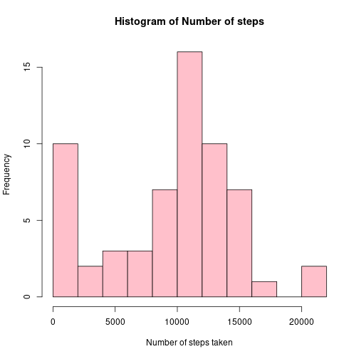
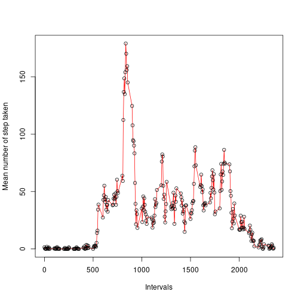
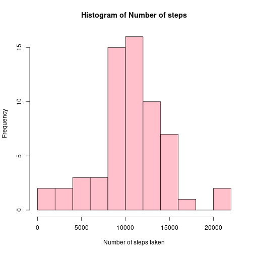
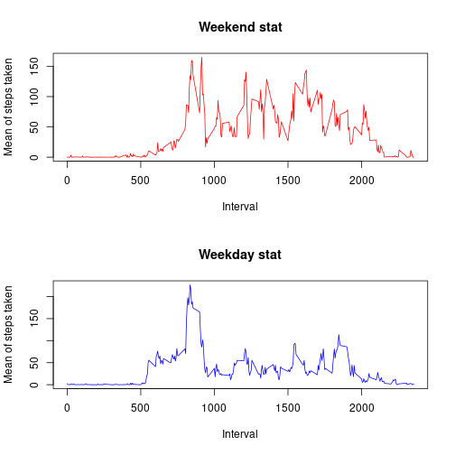

## Loading and preprocessing the data

```r
library('ggplot2')
library(scales)
input <- read.csv('./repdata_data_activity/activity.csv')
impute <- input
# Fill NA = 0 
input$steps[is.na(input$steps)] <- 0
```


## What is mean total number of steps taken per day?

```r
calSum <- sapply(split(input$steps, f= as.factor(input$date)), sum)
dateStore <- list(unique(input$date))

hist(calSum, col = 'pink', breaks = 10, xlab = "Number of steps taken", main = "Histogram of Number of steps")
```



```r
paste("Mean steps per day:", mean(calSum), "Standard deviation of steps per day", sd(calSum))
```

```
## [1] "Mean steps per day: 9354.22950819672 Standard deviation of steps per day 5405.89509515135"
```


## What is the average daily activity pattern?
### In this part, the exploratory graph where points are overlaid on a line graph 

```r
calMean <- sapply(split(input$steps, f= as.factor(input$interval)), mean)
plot(y= calMean, x=unique(input$interval) , type="l", col='red', xlab = "Intervals", ylab = "Mean number of step taken")
points(y= calMean, x=unique(input$interval))
```



```r
paste("Max value interval is ", unique(input$interval)[which.max(calMean)])
```

```
## [1] "Max value interval is  835"
```

## Imputing missing values

To Put this in context, the value imputation can be done by putting some value in the missing fields with any of the central tendency measures like mean or median. It can be as sophisticated as considring the steps distribution as normal and sampling a number from the distribution. In this case, I shall put the interval average as an imputed value. the new dataset is impute. The difference can easily be delineated because of the fact the imputed values, which is the mean of the interval. 


```r
data.frame(steps=sum(is.na(impute$steps)), 
                      interval=sum(is.na(impute$interval)), 
                   date=sum(is.na(impute$date)))
```

```
##   steps interval date
## 1  2304        0    0
```

```r
paste("Total number of NA instances 2304")
```

```
## [1] "Total number of NA instances 2304"
```


```r
all_mean <- data.frame(calMean)
for(x in 1:17568) {
  if(is.na(impute[x, 1])==TRUE) {
    impute[x, 1] <- all_mean[which(row.names(all_mean) == impute[x,3]),]
  }
}
head(impute)
```

```
##        steps       date interval
## 1 1.49180328 2012-10-01        0
## 2 0.29508197 2012-10-01        5
## 3 0.11475410 2012-10-01       10
## 4 0.13114754 2012-10-01       15
## 5 0.06557377 2012-10-01       20
## 6 1.81967213 2012-10-01       25
```

### Histogram plot

```r
calSum <- sapply(split(impute$steps, f= as.factor(impute$date)), sum)
dateStore <- list(unique(impute$date))

hist(calSum, col = 'pink', breaks = 10, xlab = "Number of steps taken", main = "Histogram of Number of steps")
```



```r
paste("Mean steps per day:", mean(calSum), "Standard deviation of steps per day", sd(calSum))
```

```
## [1] "Mean steps per day: 10581.013705993 Standard deviation of steps per day 4003.34081675338"
```
## Are there differences in activity patterns between weekdays and weekends?


```r
impute$day <- strftime(impute$date, format = "%A")
impute$weekday <- as.character(rep(0,17568))
filterWeekend <- c("Saturday", "Sunday")
impute$weekday[impute$day %in% filterWeekend] <- 1
impute %>% group_by(weekday, interval)
```

```
## # A tibble: 17,568 × 5
## # Groups:   weekday, interval [576]
##     steps date       interval day    weekday
##     <dbl> <chr>         <int> <chr>  <chr>  
##  1 1.49   2012-10-01        0 Monday 0      
##  2 0.295  2012-10-01        5 Monday 0      
##  3 0.115  2012-10-01       10 Monday 0      
##  4 0.131  2012-10-01       15 Monday 0      
##  5 0.0656 2012-10-01       20 Monday 0      
##  6 1.82   2012-10-01       25 Monday 0      
##  7 0.459  2012-10-01       30 Monday 0      
##  8 0.754  2012-10-01       35 Monday 0      
##  9 0      2012-10-01       40 Monday 0      
## 10 1.28   2012-10-01       45 Monday 0      
## # … with 17,558 more rows
```

```r
allSummary <- impute %>% group_by(weekday, interval) %>% summarise(mean(steps))
```

```
## `summarise()` has grouped output by 'weekday'. You can override using the `.groups` argument.
```

```r
wday <- allSummary[allSummary$weekday ==0,]
wend <- allSummary[allSummary$weekday ==1,]
par(mfrow=c(2, 1))
plot(x=wend$interval, wend$`mean(steps)`, xlab = "Interval", ylab = "Mean of steps taken", main = "Weekend stat", type = 'l', col='red')
plot(x=wday$interval, wday$`mean(steps)`, xlab = "Interval", ylab = "Mean of steps taken", main = "Weekday stat", type = 'l', col='blue')
```


